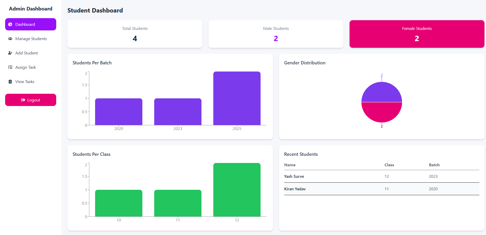
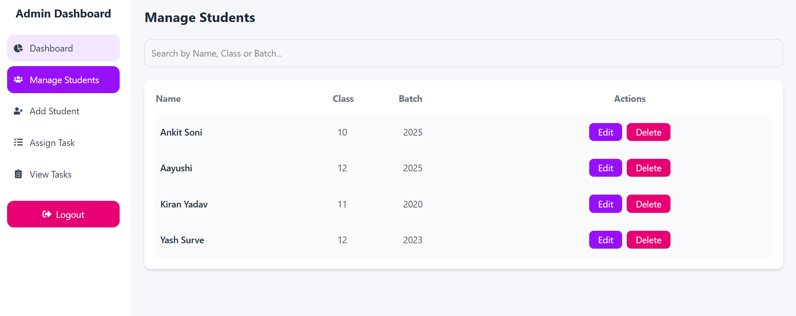
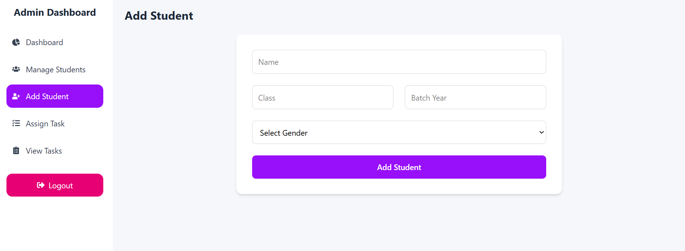
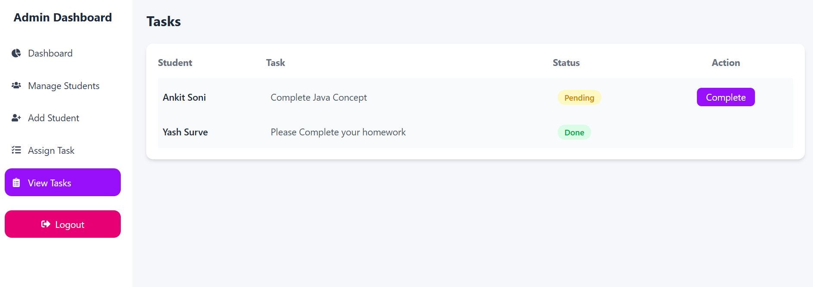

# 🎓 School Management Mini System

A full stack web application built using MERN stack to manage students and their tasks.

---

## 🚀 Features

* Admin Login (JWT Authentication)
* Add, Edit, Delete Students
* Assign Tasks to Students
* Mark Tasks as Completed
* Dashboard with Charts

  * Total Students
  * Male / Female Count
  * Students per Batch
  * Students per Class
  * Gender Distribution
  * Recent Students

---

## 🛠 Tech Stack

**Frontend:**

* React.js
* Tailwind CSS
* Recharts

**Backend:**

* Node.js
* Express.js

**Database:**

* MongoDB

---

## ⚙️ Setup Instructions

### 1. Clone Repository

git clone https://github.com/ankitsoni31/school-management-system.git

cd school-management-system

---

### 2. Backend Setup

npm install

Create `.env` file:

MONGO_URI=mongodb://localhost:27017/stu3
JWT_SECRET=your_secret_key
PORT=5000

Run backend:

node server.js

---

### 3. Frontend Setup

cd app

npm install

npm run dev

---

## 📸 Screenshots

### 📊 Dashboard

---

### 👨‍🎓 Manage Students

---

### ➕ Add Student

---

### 📋 Tasks

---

## 💡 Highlights

* Clean UI with gradient design
* Full CRUD operations
* Secure authentication (JWT)
* Interactive charts dashboard

---

## 👨‍💻 Author

**Ankit Soni**
